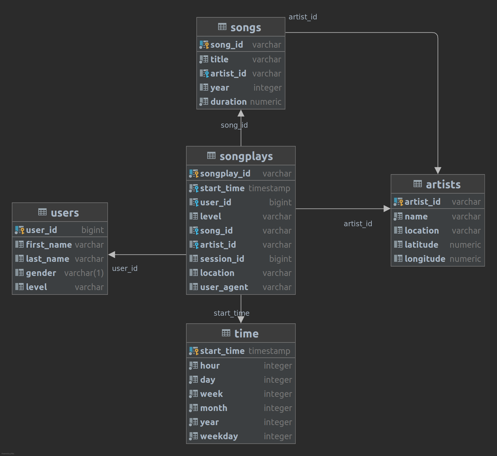

## Project info

A startup called Sparkify wants to analyze the data they've been collecting on songs and user activity on their new
music streaming app. The analytics team is particularly interested in understanding what songs users are listening to.
Currently, they don't have an easy way to query their data, which resides in a directory of JSON logs on user activity
on the app, as well as a directory with JSON metadata on the songs in their app.

The purpose of this project is to enable analytics team to get insights related to songs and user activity.

## Database schema



The database uses star schema and includes 1 fact table - songplays and dimension table: songs, users, artists and time.

## ETL pipeline design:

As this project uses a small dataset ETL pipeline uses pandas framework. If the dataset would be bigger other frameworks(like pyspark) become a more attractive choice or pandas chunksize option. And there a number of advantages to use pandas over pyspark. To name a few: it's easier to implement complex logic with pandsa and it doesn't require a cluster


## Project structure
```shell
├── create_tables.py - script with functionality to create database and drop/create tables
├── etl.py - script that runs ETL
├── README.md
└── sql_queries.py - script with SQL queries
```
